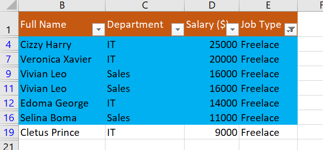
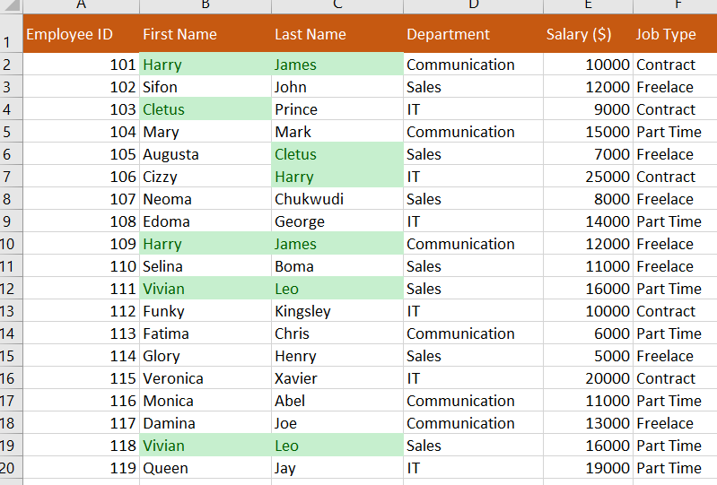
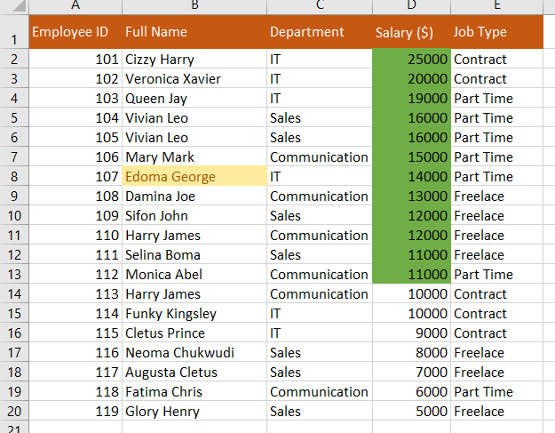

# Data Sorting, Filtering, and Formatting

### Introduction:

The Excel task serves as an introductory exercise to get familiarized with basic Excel functions, such as sorting, filtering, and formatting data. The task involved working with a dataset comprising employee information, such as; Employee ID, Employee full name, Department, Salary, and Job type.

### Skills Demonstrated:
In the course of completing this task, the following skills and concepts were demonstrated:
- Data entry and manipulation
- Sorting and filtering of data
- Data formatting
- Handling and identifying duplicates in the dataset

### Problem Statement:
### 1. Data Entry:
A dataset of 20 rows of employee information was created, consisting of the following fields:
Employee ID
Employee full name
Department (Communications, Sales, IT)
Salary (ranging from $5000 to $25000)
Job type (Part-time, Freelance, Contract)

### 2. Freelance Employees with High Salaries:
In the first worksheet, named "Worksheet1," employees classified as 'freelancers' and employees with salaries exceeding $10,000 were highlighted for easy identification.

### 3. Splitting Full Names and Handling Duplicates:
In the second worksheet, named "Worksheet2," the employee full names were split into first names and last names. Duplicated employee names were checked and highlighted.

### 4. Highlighting and Salary Formatting:
In the third worksheet, named "Worksheet3," employees whose names started with the letter 'E' were highlighted in yellow for quick identification. Furthermore, the Salary column was formatted to have a green background for the highest salary and a red background for the lowest salary.

## Conclusion: 
This Excel task demonstrates basic data manipulation and formatting. It showcases the ability to organize and present data effectively within Excel, making it a valuable skill for various business and analytical purposes.

